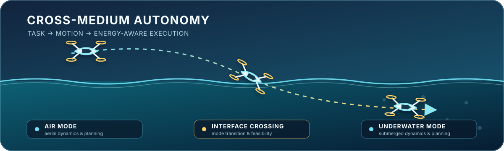

# Zhou Shuchen

**Embodied AI · Air–Water Robotics · Task & Motion Planning**

Planning and autonomy for unmanned systems that move between air and water.

  

<table>
<tr>
<td align="center" width="33%"><strong>Task Planning</strong> Mission goals and cross-medium decisions</td>
<td align="center" width="33%"><strong>Motion Planning</strong> Hybrid dynamics and interface feasibility</td>
<td align="center" width="33%"><strong>Learning & Adaptation</strong> Models, policies, and feedback</td>
</tr>
</table>

## Research question

> How can an embodied agent plan and act reliably when its vehicle crosses between air and water?

## Toolkit

`Python` `MATLAB` `C++` `ROS 2` `PX4`

## Selected work

- [Agent Island](https://github.com/sczhou9/agent-island) — a macOS menu bar app for monitoring Claude Code, Codex, and Gemini CLI sessions.

## About

Exploring how intelligent systems can plan, adapt, and act across changing physical environments.

*Research first · Build carefully · Test against the dynamics*

